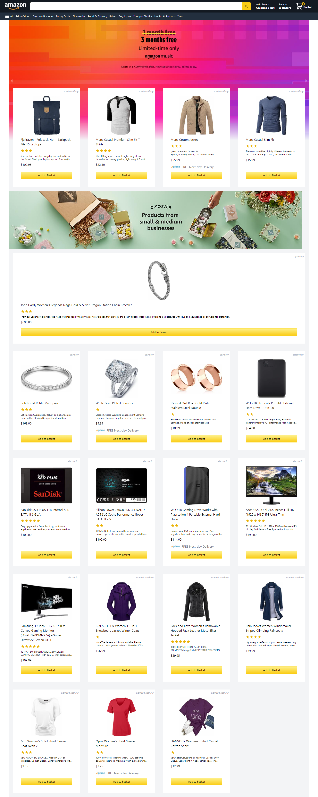

<p align="center">
  
</p>

<h3 align = "center" fontSize="60px">
  Clone do marketplace <a href="https://www.amazon.com.br/">Amazon</a>
</h3>

<p align="center">
  
</p>

## :rocket: Tecnologias

- [React.js](https://pt-br.reactjs.org/)
- [Next.js](https://nextjs.org/)
- [Next-Auth](https://next-auth.js.org/)
- [TypeScript](https://www.typescriptlang.org/)
- [Hero-icons](https://heroicons.com/)
- [Redux](https://redux.js.org/)
- [Tailwind](https://tailwindcss.com/)

## 💻 Sobre o projeto

Recriar a interface da [Amazon](https://www.airbnb.com.br/) como forma de aprendizagem e treinar as skills perante o uso de TypeScript, React e CSS.

Todos os dados dos catálogos como título, descrição, capa, foto de background e avaliação foram extraídos ao usar a [Fake Store API](https://fakestoreapi.com/).

- [DEMO](Em breve)

## 📥 Instalação e execução

Faça um clone desse repositório e acesse o diretório.

```bash
$ git clone https://github.com/renatodaltiba/amazonclone_nextjs.git && cd amazonclone_nextjs
```

```bash
# Instalando as dependências
$ yarn
# Executanto aplicação
$ yarn start
```

## :muscle: Contribuir

Faça o `fork` e clone o projeto a partir do seu usuário.

```bash
# Clonando projeto
$ git clone https://github.com/SEU-NOME-DE-USUARIO/amazonclone_nextjs.git
# Criando um branch
$ git branch minha-alteracao
# Acessando o novo branch
$ git checkout -b minha-alteracao
# Adicionando os arquivos alterados
$ git add .
# Criando commit e a mensagem
$ git commit -m "Corrigindo...."
# Enviando alterações para o brach
$ git push origin minha-alteracao
```

Você deve navegar até o seu repositório onde fez o fork e clicar no botão _New pull request_ no lado esquerdo da página.

## 📝 Licença

Esse projeto está sob a licença MIT. Veja o arquivo [LICENSE](LICENSE.md) para mais detalhes.
